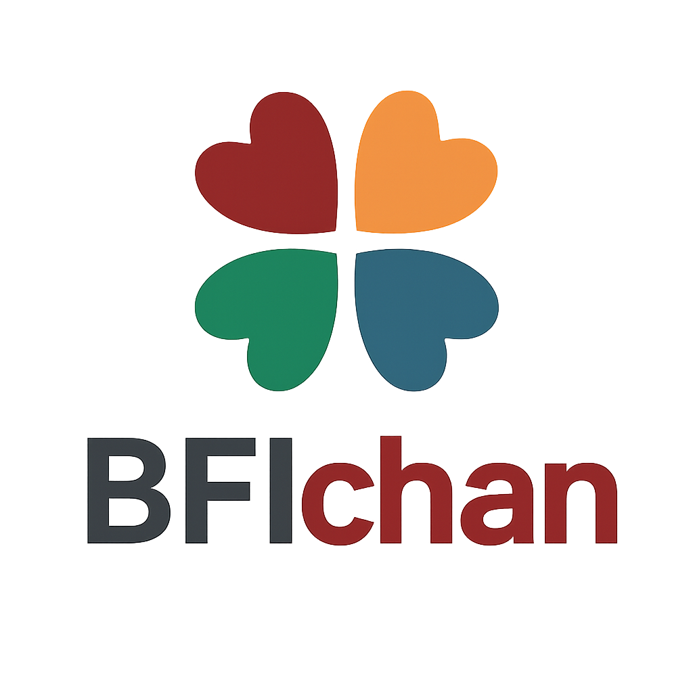

# BFI-chan

<center>
    
</center>

> [!NOTE]  
> this is a school project

## Font
this font is from [Nerdfonts](https://www.nerdfonts.com/)

## json Server

```shell
    $ npm run json
```

this opents ths json server on port 8000

## quick Install

```shell
    $ npm install
    $ npm run dev
```
